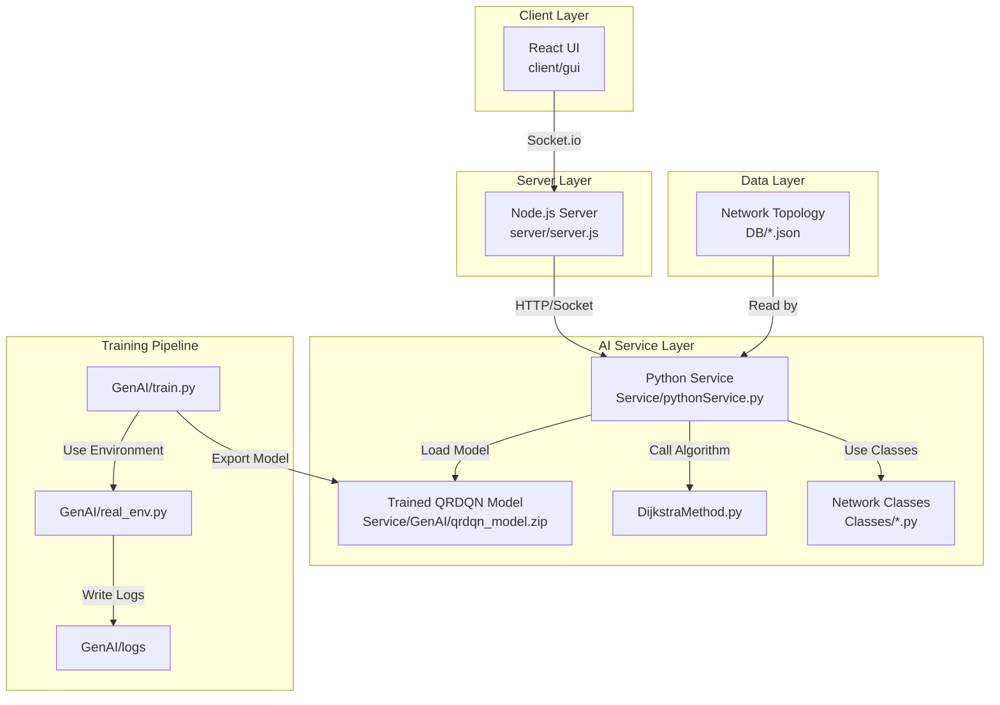

# 🚀 PBL4-SAGGINs: Định tuyến Thông minh trong Mạng Tích hợp Đa lớp

[](https://www.python.org/)
[](https://reactjs.org/)
[](https://nodejs.org/)
[](LICENSE)
[](https://stable-baselines3.readthedocs.io/)

> **SAGGINs (Satellite-Air-Ground-Sea Integrated Networks)**: Một dự án mô phỏng và tối ưu hóa việc định tuyến dữ liệu trong Mạng Tích hợp Vệ tinh - Hàng không - Mặt đất - Hàng hải bằng cách sử dụng Thuật toán Học tăng cường sâu (Deep Reinforcement Learning).

---

## 📑 Mục lục

- [Giới thiệu](#-giới-thiệu)
- [Kiến trúc Hệ thống](#️-kiến-trúc-hệ-thống)
- [Tính năng Chính](#-tính-năng-chính)
- [Lõi AI: Tại sao lại là QRDQN?](#-lõi-ai-tại-sao-lại-là-qrdqn)
- [Công nghệ sử dụng](#-công-nghệ-sử-dụng)
- [Cài đặt và Chạy dự án](#️-cài-đặt-và-chạy-dự-án)
- [Cấu trúc Thư mục](#-cấu-trúc-thư-mục)
- [Demo & Screenshots](#-demo--screenshots)
- [Đóng góp](#-đóng-góp)
- [Tác giả](#-tác-giả)

---

## 🌐 Giới thiệu

Dự án này giải quyết bài toán **định tuyến (routing)** phức tạp trong một môi trường mạng **không đồng nhất (heterogeneous)** và **động (dynamic)**, bao gồm nhiều lớp:

- 🛰️ **Vệ tinh (Satellite)**
- ✈️ **Phương tiện bay không người lái (UAV)**
- 🏢 **Trạm mặt đất (Ground Station)**
- 🚢 **Trạm trên biển (Sea Station)**

### Mục tiêu

Xây dựng một **tác nhân (agent) AI** có khả năng đưa ra quyết định định tuyến tối ưu cho các yêu cầu (request) dữ liệu, nhằm:

✅ **Giảm thiểu độ trễ (latency)**  
✅ **Tối đa hóa thông lượng (throughput)**  
✅ **Thích ứng với môi trường động**

Dự án sử dụng mô hình **QRDQN (Quantile Regression Deep Q-Network)** để học chính sách định tuyến và so sánh hiệu suất với thuật toán **Dijkstra** cổ điển.

Đi kèm với giao diện **trực quan hóa 3D** (React + Three.js) để mô phỏng Trái Đất, các thiết bị mạng và luồng dữ liệu theo thời gian thực.

---

## 🏛️ Kiến trúc Hệ thống

Hệ thống được thiết kế theo kiến trúc **microservice**, tách biệt rõ ràng giữa giao diện người dùng, máy chủ quản lý và dịch vụ AI.



### Các Thành phần Chính

| Component | Công nghệ | Mô tả |
|-----------|-----------|-------|
| **Client (React)** | React + Three.js + Socket.io | Trực quan hóa mạng lưới 3D trên mô hình Trái Đất |
| **Web Server** | Node.js + Express + Socket.io | Cầu nối giữa client và AI service |
| **AI Service** | Python + Flask/gRPC | Microservice xử lý định tuyến với QRDQN |
| **Training Environment** | Python + Gymnasium + SB3 | Môi trường huấn luyện mô hình AI |

---

## ✨ Tính năng Chính

### 🛰️ Trực quan hóa 3D
Mô phỏng mạng lưới SAGGINs trên mô hình địa cầu tương tác, hiển thị:
- Vị trí vệ tinh, trạm mặt đất, UAV
- Các luồng dữ liệu theo thời gian thực
- Trạng thái kết nối động

### 🧠 Định tuyến bằng AI
- Sử dụng **QRDQN** để tìm đường đi tối ưu
- Thích ứng với trạng thái thay đổi (kết nối vệ tinh bị ngắt, tắc nghẽn)
- Học từ phân phối phần thưởng thay vì chỉ giá trị trung bình

### 📊 So sánh Hiệu suất
- Tích hợp thuật toán **Dijkstra** làm baseline
- So sánh về độ trễ, chi phí, tỷ lệ thành công
- Ghi log tự động (`Service/comparison_log.csv`)

### 🎮 Mô phỏng Động
- Tạo requests theo thời gian
- Quan sát cách mạng lưới xử lý
- Điều chỉnh tham số mô phỏng real-time

---

## 🔬 Lõi AI: Tại sao lại là QRDQN?

### Vấn đề với DQN truyền thống

Trong bài toán định tuyến mạng, các yếu tố như **độ trễ (latency)** không phải lúc nào cũng ổn định mà thường **biến động** (tắc nghẽn, nhiễu).

❌ **DQN truyền thống** chỉ học giá trị **trung bình** (mean) của phần thưởng  
❌ Một đường đi có độ trễ trung bình 10ms nhưng thỉnh thoảng lên 500ms  
❌ Có thể được đánh giá tương đương một đường đi luôn ổn định ở 20ms

### Giải pháp: QRDQN

✅ **QRDQN** học toàn bộ **phân phối (distribution)** của phần thưởng  
✅ Hiểu rõ hơn về **rủi ro** và **độ biến động**  
✅ Có thể huấn luyện tác nhân **risk-averse** (tránh rủi ro)

```python
# Ví dụ: Ưu tiên đường đi có độ trễ ở quantile 90% thấp nhất
# Đảm bảo tính ổn định cho yêu cầu quan trọng
```

### Chi tiết Kỹ thuật

| Thành phần | Mô tả |
|------------|-------|
| **Môi trường** | `GenAI/real_env.py` - Gymnasium environment |
| **Mô hình** | QRDQN từ Stable-Baselines3 |
| **Trạng thái** | Vị trí hiện tại, đích, kích thước request, trạng thái mạng |
| **Hành động** | Chọn next hop trong số các nút lân cận |
| **Phần thưởng** | `reward = -latency` (tối đa hóa = giảm độ trễ) |

---

## 💻 Công nghệ sử dụng

### Frontend


### Backend


### AI & Machine Learning


### Bảng Chi tiết

| Lĩnh vực | Công nghệ |
|----------|-----------|
| **Frontend** | React, Three.js (react-three-fiber), Socket.io-client |
| **Web Server** | Node.js, Express, Socket.io |
| **AI Framework** | Stable-Baselines3, Gymnasium, PyTorch |
| **Data Processing** | NumPy, Pandas |
| **Data Storage** | JSON |

---

## 🛠️ Cài đặt và Chạy dự án

### Yêu cầu Hệ thống

- **Node.js** 16+ và **npm**
- **Python** 3.9+
- **Git**
- RAM tối thiểu: 4GB
- GPU (khuyến nghị cho training, không bắt buộc cho inference)

### 1. Clone Repository

```bash
git clone https://github.com/capkimkhanh2k5/PBL4_SAGGINs.git
cd PBL4_SAGGINs
```

### 2. Cài đặt Backend

#### Node.js Server

```bash
cd server
npm install
```

#### Python AI Service

```bash
cd ../Service

# Tạo môi trường ảo (khuyến nghị)
python -m venv venv

# Kích hoạt môi trường ảo
# Windows:
venv\Scripts\activate
# Linux/Mac:
source venv/bin/activate

# Cài đặt dependencies
pip install -r requirements.txt
```

> **Lưu ý:** Nếu không có `requirements.txt`, cài đặt thủ công:
> ```bash
> pip install stable-baselines3[extra] gymnasium numpy pandas flask
> ```

### 3. Cài đặt Frontend

```bash
cd ../client/gui
npm install
```

### 4. Chạy Hệ thống

Bạn cần **3 terminal** riêng biệt để chạy các service song song:

#### Terminal 1: AI Service (Python)

```bash
cd Service
source venv/bin/activate  # hoặc venv\Scripts\activate trên Windows
python pythonService.py
```

#### Terminal 2: Web Server (Node.js)

```bash
cd server
npm start
```

#### Terminal 3: Client (React)

```bash
cd client/gui
npm start
```

### 5. Truy cập Ứng dụng

Mở trình duyệt và truy cập:

```
http://localhost:3000
```

---

## 📁 Cấu trúc Thư mục

```
PBL4_SAGGINs/
│
├── 📂 Classes/                 # Các lớp Python lõi
│   ├── Node.py                 # Lớp cơ sở cho các nút mạng
│   ├── Satellite.py            # Lớp vệ tinh
│   ├── GroundStation.py        # Lớp trạm mặt đất
│   └── Network.py              # Lớp quản lý mạng tổng thể
│
├── 📂 DB/                      # Dữ liệu cấu hình mạng
│   ├── satellites.json         # Dữ liệu vệ tinh
│   ├── ground_stations.json    # Dữ liệu trạm mặt đất
│   └── network_topology.json   # Cấu trúc mạng
│
├── 📂 GenAI/                   # AI Training Pipeline
│   ├── 📂 logs/                # TensorBoard logs & checkpoints
│   ├── DijkstraMethod.py       # Baseline algorithm
│   ├── real_env.py             # Custom Gym environment
│   └── train.py                # Training script cho QRDQN
│
├── 📂 Service/                 # Python Microservice
│   ├── 📂 GenAI/
│   │   └── qrdqn_model.zip     # Trained AI model
│   ├── pythonService.py        # Main service entry point
│   └── comparison_log.csv      # Performance comparison logs
│
├── 📂 client/
│   └── 📂 gui/                 # React Frontend Application
│       ├── 📂 src/
│       │   ├── 📂 components/  # React components
│       │   ├── 📂 scenes/      # Three.js 3D scenes
│       │   └── App.js          # Main app component
│       ├── package.json
│       └── ...
│
├── 📂 server/
│   ├── server.js               # Node.js Express server
│   ├── package.json
│   └── ...
│
├── 📂 server_gui/              # Optional: Monitoring Dashboard
│   └── ...
│
├── .gitignore
├── README.md
└── LICENSE
```

### Mô tả Chi tiết

| Thư mục | Mục đích |
|---------|----------|
| `Classes/` | Định nghĩa các thực thể mạng (Node, Satellite, UAV, etc.) |
| `DB/` | Lưu trữ cấu hình topology mạng dạng JSON |
| `GenAI/` | Pipeline training AI model (offline) |
| `Service/` | Microservice phục vụ inference request |
| `client/gui/` | Giao diện 3D visualization |
| `server/` | API gateway và WebSocket server |

---

## 📸 Demo & Screenshots

### 🌍 Giao diện Trực quan hóa 3D

```
[Hình ảnh mô phỏng Trái Đất với các vệ tinh, trạm mặt đất và luồng dữ liệu]
```

### 📊 Dashboard So sánh Hiệu suất

```
[Biểu đồ so sánh QRDQN vs Dijkstra về latency và throughput]
```

### 🎮 Mô phỏng Real-time

```
[Video demo về việc tạo request và quan sát routing decision]
```

> **Lưu ý:** Thêm screenshots/video vào thư mục `assets/` và cập nhật đường dẫn

---

## 🤝 Đóng góp

Chúng tôi hoan nghênh mọi đóng góp! Để đóng góp:

1. **Fork** repository này
2. Tạo **branch** mới (`git checkout -b feature/AmazingFeature`)
3. **Commit** thay đổi (`git commit -m 'Add some AmazingFeature'`)
4. **Push** lên branch (`git push origin feature/AmazingFeature`)
5. Mở **Pull Request**

### Coding Standards

- Python: Follow PEP 8
- JavaScript: ESLint + Prettier
- Commit messages: [Conventional Commits](https://www.conventionalcommits.org/)

---

## 📄 License

Dự án này được phân phối dưới giấy phép **MIT License**. Xem file [LICENSE](LICENSE) để biết thêm chi tiết.

---

## 👨‍💻 Tác giả

**Phát triển bởi:** Cáp Kim Khánh

- 📧 Email: capkimkhanh2k5@gmail.com
- 🔗 GitHub: [@capkimkhanh2k5](https://github.com/capkimkhanh2k5)
- 💼 LinkedIn: [Cáp Kim Khánh](https://www.linkedin.com/in/capkimkhanh)

---

## 🙏 Lời cảm ơn

- **Stable-Baselines3** team cho framework RL tuyệt vời
- **Three.js** community cho công cụ visualization mạnh mẽ
- **OpenAI Gym/Gymnasium** cho môi trường RL chuẩn hóa

---

<div align="center">

### ⭐ Nếu dự án này hữu ích, hãy cho một Star! ⭐

**Made with ❤️ for AI & Network Optimization**

[](https://github.com/capkimkhanh2k5/PBL4_SAGGINs)

</div>
